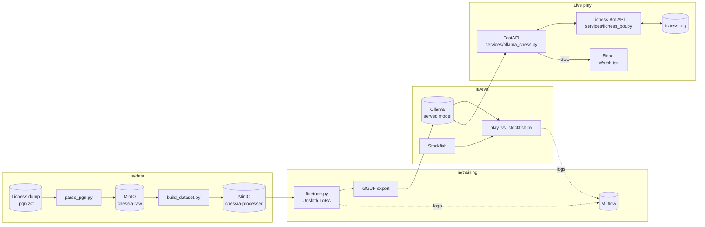

<div align="center">

# ChessIA

**An LLM that plays chess — locally, or for real on Lichess, live.**

School project: fine-tune a language model to play chess, serve it through Ollama, and watch it play — from a quick local demo to an actual rated-adjacent game on a real chess server.

[](frontend)
[](api)
[](https://lichess.org/api)
[](ia/training)
[](ia/README.md)
[](http://localhost:5000)
[](docker-compose.yml)
[](ia/data)

</div>

---

## Demo

> 🎥 *Video coming soon — a full game played live by the model on Lichess, rendered in the frontend.*

<!--
  Once the video is ready: drop it into a GitHub issue/PR (drag & drop) to get a
  user-images.githubusercontent.com link, then replace this block with:
  https://github.com/user-attachments/assets/<id>
-->

---

## How it works, in one paragraph

A chess-specialized LLM ([`Qwen2.5-Coder-0.5B`, RL-tuned on Lichess puzzles](https://huggingface.co/alexneakameni/Qwen2.5-Coder-0.5B-Instruct-chess-grpo)) is fine-tuned further on real Lichess games, exported to GGUF, and served by **Ollama**. A **FastAPI** backend feeds it positions one at a time — either to drive a local demo, or to actually play a live game on **Lichess** via the Bot API, submitting real moves on a real board. The **React** frontend shows either in real time. Everything — data prep, training, evaluation, and the live game loop — runs locally, GPU included.

## Game modes

The app offers two fundamentally different ways to watch (or set up) a game, both reachable from the **"Play vs bot"** page:

| | **Local** | **Live on Lichess** |
|---|---|---|
| **Opponent** | Stockfish, running in your browser (WASM) | Lichess's built-in AI (levels 1-8), *or* a specific player/bot you challenge by username |
| **Who's actually "the AI"?** | Just a chess engine — no LLM, no account, purely a UI demo | Our fine-tuned LLM, via Ollama, making every move |
| **Account needed?** | No | Yes — your Lichess account (connected via OAuth) |
| **Time control** | Fixed per difficulty preset | Your choice: Bullet, Blitz, Rapid, Classical, or Correspondence |
| **Variant** | Standard only | Standard, Chess960, Crazyhouse, Atomic, King of the Hill, Racing Kings, Horde, Three-check, Antichess |
| **Rated** | N/A | Optional, for player/bot challenges |
| **How you watch** | Instant, in-page | Streamed live (Server-Sent Events): real countdown clock, animated piece moves, a clear "our AI plays White/Black" indicator |
| **Where it happens** | Nowhere but your browser | A real game on lichess.org — spectators on Lichess can watch too |

There's also a **pure spectator mode** ("Watch") reachable from the home page: the local engine plays both sides of a game by itself, for a quick "just show me something moving" demo with no setup at all.

### Why a real Lichess account is involved

To let an account *play* moves programmatically (not just fetch data), Lichess requires it to be upgraded to a **BOT account** — a one-time, **irreversible** change (a bot account can only ever play bot/challenge games afterward, never normal rated matchmaking). This project's connected account has been upgraded on purpose for exactly this use case.

### What happens if the model messes up mid-game

Unlike the local evaluation harness (which just marks a game "failed"), a live Lichess game can't be left hanging. If the model fails to produce a legal move after 3 retries, the API automatically **resigns the game** rather than stalling — safe by construction, no game (and no account) ever gets stuck.

## What we learned

First full sweep: Gemma 2 2B, LoRA, dataset sizes from 5,000 to 30,000 FEN→move examples (filtered to Elo 1800-2200). Result: **0 legal games out of 5, at every single size**. The model breaks down on its very first move — not for lack of general chess knowledge (its raw completions reference real openings, real players, real chess trivia), but because the "respond with only a move" format doesn't hold at this fine-tuning scale.

Pivot: start from a model that's already chess-specialized instead of a generalist. Clear improvement — **2 to 10 legal moves in a row** per game instead of failing immediately (an actual sequence like `Nh3 Nc6 Ng5 d5 Nxh7 Bf5 Nxf8 Nf6` came out of one run), now proven live on Lichess itself. Continuing to fine-tune that same specialist on our own filtered data (10k examples) didn't clearly improve on a small sample — inconclusive so far, tracked in MLflow for the next iteration.

Full details, exact numbers, and the pipeline that produced them: [`ia/README.md`](ia/README.md).

## Architecture



## Stack

| Area | Tech |
|---|---|
| Frontend | React 19, TypeScript, Vite, chess.js, Stockfish (WASM), Server-Sent Events |
| API | FastAPI, OAuth PKCE (Lichess), httpx, Lichess Bot API |
| Data | python-chess, zstandard, polars, boto3 (MinIO) |
| Fine-tuning | Unsloth, PEFT/LoRA, Transformers, PyTorch (CUDA 12.8, Blackwell), MLflow |
| Serving | Ollama, GGUF format |
| Infra | Docker Compose (MinIO, Ollama, MLflow, on-demand training/eval containers) |

## Getting started

```bash
cp .env.example .env        # fill in MinIO credentials
docker compose up -d        # MinIO + Ollama + MLflow
```

- Data / fine-tuning / evaluation pipeline → [`ia/README.md`](ia/README.md)
- Raw Lichess dataset → [`data/README.MD`](data/README.MD)
- MLflow UI → http://localhost:5000
- API: `cd api/app && ../venv/Scripts/python.exe -m uvicorn main:app --reload`
- Frontend: `cd frontend && npm install && npm run dev`

To let the API actually play on Lichess, the connected account must be [upgraded to a BOT account](https://lichess.org/api#tag/Bot/operation/botAccountUpgrade) (see [Why a real Lichess account is involved](#why-a-real-lichess-account-is-involved) above — irreversible).

## Structure

```
ChessIA/
├── frontend/        # React + Vite — board, history, auth, live game viewer
├── api/
│   ├── app/routes/   # auth (Lichess OAuth), bot (game history), play (live games)
│   └── app/services/ # lichess_bot.py (Bot API client), ollama_chess.py (move generation)
├── data/            # Raw PGN dump + generated datasets (gitignored)
├── ia/
│   ├── data/        # Parsing + dataset building
│   ├── training/    # LoRA fine-tuning + GGUF export, MLflow-tracked
│   ├── eval/         # Automated games vs Stockfish, MLflow-tracked
│   └── run_threshold_sweep.py
└── docker-compose.yml
```

## Roadmap

- [x] Frontend + Lichess auth
- [x] Streamed data pipeline (MinIO)
- [x] LoRA fine-tuning + GGUF export + Ollama serving
- [x] Automated evaluation harness vs Stockfish
- [x] Experiment tracking (MLflow)
- [x] Wire the API to Ollama and the Lichess Bot API — the model plays real games
- [x] Live display on the frontend (Server-Sent Events), with clock, animations, and opponent/variant/time-control selection
- [ ] Get a clearly better legal-move rate out of continued fine-tuning
- [ ] Model size comparison (0.5B / 2B / 3B / 8B) for the report

---

<div align="center">

Built by [liljoker06](https://github.com/liljoker06) , [ahamie71](https://github.com/ahamie71) , [Batyeste](https://github.com/Batyeste)

</div>
