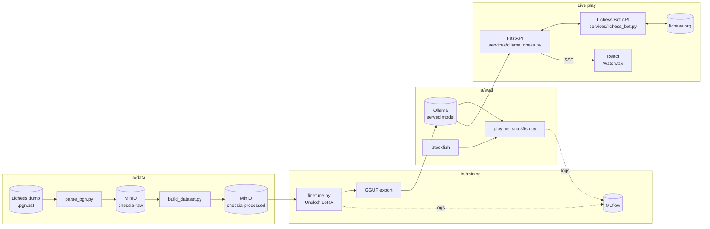

<div align="center">

# ChessIA

**Watching an AI play chess — including for real, live, on Lichess.**

School project: fine-tune an LLM to play chess, serve it locally, and watch it play move by move in the browser — or let it play an actual game on Lichess through the Bot API.

[](frontend)
[](api)
[](https://lichess.org/api)
[](ia/training)
[](ia/README.md)
[](http://localhost:5000)
[](docker-compose.yml)
[](ia/data)

</div>

---

## Demo

### Présentation

https://github.com/user-attachments/assets/e2d28471-9f5d-426a-a152-716cc357aab5
### MLflow

https://github.com/user-attachments/assets/1faba81c-481d-4167-8857-90553c340bcb

---

## What this is

Not a bot to chat with, not an opponent to face: **you watch**. A model plays a real game — against Lichess's built-in AI, or against a specific player/bot you challenge — one move at a time, live on the board, with a real clock ticking. Or, if you'd rather not touch the Lichess account, it can just play itself locally in the browser.

What makes it interesting: the "brain" isn't a classic chess engine (minimax + evaluation), it's an **LLM fine-tuned** to produce legal moves from a position. The central question of the project: *how many examples does it take for a small model to learn to reliably follow the rules of the game?* — and, once that's answered, watching the result play an actual rated-adjacent game on a real chess server.

## What works today

- **Frontend** (React + TypeScript + Vite) — interactive board with animated piece moves, game history, Lichess OAuth login, and two ways to watch a game:
  - **Local**: pick a color/difficulty, the model plays against a local Stockfish (WASM) instantly, no account needed.
  - **Live on Lichess**: pick an opponent (Lichess's built-in AI, or a specific player/bot you challenge), a time control (Bullet → Correspondence), and a variant (Standard, Chess960, Crazyhouse, Atomic, King of the Hill, Racing Kings, Horde, Three-check, Antichess) — the game is streamed live via Server-Sent Events, with a real countdown clock and a clear "our AI plays White/Black" indicator.
- **API** (FastAPI) — Lichess OAuth (PKCE, `bot:play`/`challenge:write` scopes), a Bot API client (`api/app/services/lichess_bot.py`) that creates/streams/plays real Lichess games, and the move-generation bridge to Ollama (`api/app/services/ollama_chess.py`).
- **Data pipeline** (`ia/data`) — streamed parsing of a Lichess PGN dump (29 GB compressed → never extracted to disk), filtering by Elo and Stockfish eval, JSONL export, all backed by MinIO as S3-compatible storage.
- **Fine-tuning** (`ia/training`) — LoRA via Unsloth, GGUF export, automatic registration as an Ollama model, every run tracked in **MLflow** (params, loss curves, and downstream eval metrics linked to the same run).
- **Evaluation** (`ia/eval`) — the model plays against Stockfish (very weak level) in a dedicated container, binary verdict: fully legal game or not, logged to MLflow alongside the training run that produced the model.

Everything runs locally, GPU included (tested on an RTX 5070 Ti / Blackwell).

## What we learned

First full sweep: Gemma 2 2B, LoRA, dataset sizes from 5,000 to 30,000 FEN→move examples (filtered to Elo 1800-2200). Result: **0 legal games out of 5, at every single size**. The model breaks down on its very first move — not for lack of general chess knowledge (it clearly has some: its raw completions reference real openings, real players, real chess trivia), but because the "respond with only a move" format doesn't hold at this fine-tuning scale.

Pivot: started from a model that's already chess-specialized instead of a generalist — [`Qwen2.5-Coder-0.5B` fine-tuned via RL on Lichess puzzles](https://huggingface.co/alexneakameni/Qwen2.5-Coder-0.5B-Instruct-chess-grpo), used as-is (no further training from us yet). Clear improvement: the model now plays **2 to 10 legal moves in a row** per game instead of failing immediately — still not a fully clean game every time, but real, coherent chess (an actual sequence like `Nh3 Nc6 Ng5 d5 Nxh7 Bf5 Nxf8 Nf6` came out of one run). It's now proven live on Lichess itself, complete with a resign-as-fallback safety net so a bad generation never leaves a game stuck.

Details, the full pipeline, and next steps in [`ia/README.md`](ia/README.md).

## Architecture



## Stack

| Area | Tech |
|---|---|
| Frontend | React 19, TypeScript, Vite, chess.js, Stockfish (WASM), Server-Sent Events |
| API | FastAPI, OAuth PKCE (Lichess), httpx, Lichess Bot API |
| Data | python-chess, zstandard, polars, boto3 (MinIO) |
| Fine-tuning | Unsloth, PEFT/LoRA, Transformers, PyTorch (CUDA 12.8, Blackwell), MLflow |
| Serving | Ollama, GGUF format |
| Infra | Docker Compose (MinIO, Ollama, MLflow, on-demand training/eval containers) |

## Getting started

```bash
cp .env.example .env        # fill in MinIO credentials
docker compose up -d        # MinIO + Ollama + MLflow
```

- Data / fine-tuning / evaluation pipeline → [`ia/README.md`](ia/README.md)
- Raw Lichess dataset → [`data/README.MD`](data/README.MD)
- MLflow UI → http://localhost:5000
- API: `cd api/app && ../venv/Scripts/python.exe -m uvicorn main:app --reload`
- Frontend: `cd frontend && npm install && npm run dev`

To let the API actually play on Lichess, the connected account must be [upgraded to a BOT account](https://lichess.org/api#tag/Bot/operation/botAccountUpgrade) (irreversible — it can then only ever play bot games, never rated matchmaking again).

## Structure

```
ChessIA/
├── frontend/        # React + Vite — board, history, auth, live game viewer
├── api/
│   ├── app/routes/   # auth (Lichess OAuth), bot (game history), play (live games)
│   └── app/services/ # lichess_bot.py (Bot API client), ollama_chess.py (move generation)
├── data/            # Raw PGN dump + generated datasets (gitignored)
├── ia/
│   ├── data/        # Parsing + dataset building
│   ├── training/    # LoRA fine-tuning + GGUF export, MLflow-tracked
│   ├── eval/         # Automated games vs Stockfish, MLflow-tracked
│   └── run_threshold_sweep.py
└── docker-compose.yml
```

## Roadmap

- [x] Frontend + Lichess auth
- [x] Streamed data pipeline (MinIO)
- [x] LoRA fine-tuning + GGUF export + Ollama serving
- [x] Automated evaluation harness vs Stockfish
- [x] Experiment tracking (MLflow)
- [x] Wire the API to Ollama and the Lichess Bot API — the model plays real games
- [x] Live display on the frontend (Server-Sent Events), with clock, animations, and opponent/variant/time-control selection
- [ ] Continue fine-tuning the chess-specialized base model on our own filtered Lichess data
- [ ] Model size comparison (0.5B / 2B / 3B / 8B) for the report

---

<div align="center">

Built by [liljoker06](https://github.com/liljoker06) , [ahamie71](https://github.com/ahamie71) , [Batyeste](https://github.com/Batyeste)

</div>
